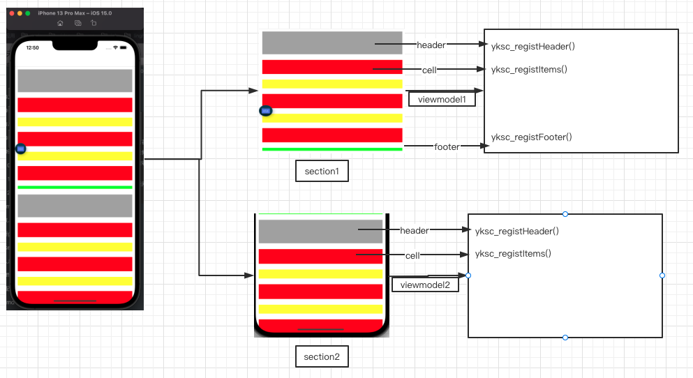

# YKSwiftSectionViewModel

[](https://cocoapods.org/pods/YKSwiftSectionViewModel) [](https://gitee.com/Edwrard/YKSwiftSectionViewModel)[](https://gitee.com/Edwrard/YKSwiftSectionViewModel/blob/master/LICENSE)

## Requirements

- iOS 9.0+ 
- Xcode 9.3+
- Swift 4.0+


## 



## Installation

YKSwiftSectionViewModel is available through [CocoaPods](https://cocoapods.org). To install
it, simply add the following line to your Podfile:

```ruby
pod 'YKSwiftSectionViewModel'
```

Then, run the following command:

```
$ pod install
```

## Example

### 1、init

```swift

    public lazy var collectionView:YKSectionCollectionView = {
        let viewModel1 = ScTestViewModel.init()
        其中 frame 为 布局 datas为内部包含多少个sectionviewmodel
        let view = YKSectionCollectionView.init(frame: CGRect.init(x: 0, y: KSTATUSBAR_HEIGHT + 44, width: YKScreenW, height: YKScreenH - (KSTATUSBAR_HEIGHT + 44)),datas: [viewModel1])
        let headerView = UIView.init(frame: CGRect(x: 0, y: 0, width: view.bounds.size.width, height: 50)).yk_backgroundColor(.red)
        
        每个sectionviewmodel可设置的延迟时间
        view.outTime = 15
        
        //此方法为笔者自定义的头部刷新，用户可根据自己情况设置刷星
        view.addRefreshHeader { [weak self] in
            YKSwiftAlertCenter.showLoading(message: "正在加载")
            //主要方法为此refreshData告诉section刷新的模式（其中头部刷新和底部刷新）
            self!.collectionView.refreshData(mode: .Header)
        }
        
        //同上
        view.addRefreshFooter { [weak self] in
            self!.collectionView.refreshData(mode: .Footer)
        }
        
        //方法为结束刷新时候的动作 用户可根据自己的情况选择结束顶部和底部的刷新动画（笔者内容已经动态调用了reloadData，用户无需自行调用）
        view.toSetEndRefresh { [weak self] isNoMoreData in
            YKSwiftAlertCenter.dissLoading()
            if let strongself = self {
                strongself.collectionView.headerEndRefresh()
                strongself.collectionView.footerEndRefresh(noMorData: false)
            }
        }
        
        //方法为结束刷新时候进行了错误的报告，内部为笔者自定义的弹窗，用户可根据自己项目进行错误处理
        view.toSetErrorCallBack { error in
            YKSwiftAlertCenter.showMessage(message: error.localizedDescription)
        }
        
        //（重点）此方法为内部响应的操作，传递出来控制器进行分别的push或present出来
        view.toSetHandleViewController { [weak self] controller, type, animated in
            guard let weakself = self else { return }
            if type == .Push {
                weakself.navigationController?.pushViewController(controller, animated: animated)
            }else if type == .Present {
                weakself.present(controller, animated: animated, completion: nil)
            }
        }
        return view
    }()
```

### 2、initsubviewmodel

```swift
import YKSwiftSectionViewModel

class ScTestViewModel: YKSectionViewModelMainProtocol {
    
    private var count:Int = 0
    
    //  （必须实现） 当前section拥有多少个item
    func yksc_numberOfItem() -> Int {
        return self.count
    }
    
    //  （必须实现） 当前section获取数据源（网络请求等延时操作）
    func yksc_beginToReloadData(mode: YKSectionViewModelRefreshMode.RawValue, reloadCallBack: @escaping ((Bool) -> Void), errorCallBack: @escaping ((Error) -> Void)) {
       if mode == YKSectionViewModelRefreshMode.Header.rawValue {
           self.count += 5;
       }else if mode == YKSectionViewModelRefreshMode.Footer.rawValue {
           let error = NSError.init(domain: "YKSwiftSectionViewModel", code: -1, userInfo: [
               NSLocalizedDescriptionKey:"错误",
               NSLocalizedFailureReasonErrorKey:"错误",
               NSLocalizedRecoverySuggestionErrorKey:"请检查内容",
           ])
           errorCallBack(error)
       }
       reloadCallBack(true)
    }
    
    //  （必须实现） 当前section的indexPath用到的itemId
    func yksc_idForItem(at indexPath: IndexPath) -> String {
        if ((indexPath.row % 2) == 1) {
            return "ScTest2Cell"
        }
        return "ScTestCell"
    }
    
    //  （必须实现） 注册当前section所用到的所有item
    func yksc_registItems() -> [YKSectionResuseModel] {
        return [YKSectionResuseModel.init(className: ScTestCell.classForCoder(), classId: "ScTestCell"),YKSectionResuseModel.init(className: ScTest2Cell.classForCoder(), classId: "ScTest2Cell")]
    }
            
    //  （必须实现） 当前section的item的大小
    func yksc_sizeOfItem(with width: CGFloat, atIndexPath: IndexPath) -> CGSize {
        if ((atIndexPath.row % 2) == 1) {
            return CGSize(width: width, height: 50)
        }
        return CGSize(width: width, height: 70)
    }
        
    // 注册当前section所需要用到的header （无设置可忽略）
    func yksc_registHeader() -> [YKSectionResuseModel] {
        return [YKSectionResuseModel.init(className: SCTestHeaderView.classForCoder(), classId: "SCTestHeaderView")]
    }
        
    // 当前section所需要设置的header （无设置可忽略）
    func yksc_idForHeader() -> String {
        return "SCTestHeaderView"
    }
        
    // 当前section的header的大小 （无设置可忽略）
    func yksc_sizeOfHeader(width: CGFloat) -> CGSize {
        return CGSize(width: width, height: 100)
    }
    
    // 注册当前section所需要用到的footer （无设置可忽略）
    func yksc_registFooter() -> [YKSectionResuseModel] {
        return [YKSectionResuseModel.init(className: SCTestFooterView.classForCoder(), classId: "SCTestFooterView")]
    }
    
    // 当前section所需要设置的footer （无设置可忽略）
    func yksc_idForFooter() -> String {
        return "SCTestFooterView"
    }
    
    // 当前section的footer的大小 （无设置可忽略）
    func yksc_sizeOfFooter(width: CGFloat) -> CGSize {
        return CGSize(width: width, height: 30)
    }
    
    // 当前section其中cell被点击的响应
    func yksc_didSelectItem(at indexPath: IndexPath, collectionView: YKSectionCollectionView, callBack: ((UIViewController, YKSectionViewModelPushType, Bool) -> Void)) {
        
    }
    
    // 响应链传递(如没有可忽略)
    func yksc_handleRouterEvent(eventName: String, userInfo: Dictionary<String, Any>, collectionView: YKSectionCollectionView, callBack: ((UIViewController, YKSectionViewModelPushType, Bool) -> Void)) -> Bool {
        
        return false
    }
    
    func yksc_noDataShowHeaderFooter() -> Bool {
        return false
    }
```

### 3、initcell or header

#### cell
```swift
import YKSwiftSectionViewModel

class ScTest2Cell: YKSectionCollectionViewCell,YKSectionViewModelResuseProtocol {
    
    override init(frame: CGRect) {
        super.init(frame: frame)
        let view = UIView.init(frame: CGRect(x: 10, y: 10, width: self.bounds.size.width - 20, height: self.bounds.size.height - 20))
        view.backgroundColor = .yellow
        self.addSubview(view)
    }
    
    required init?(coder: NSCoder) {
        fatalError("init(coder:) has not been implemented")
    }
    
    func loadData(_ viewModel: YKSectionCollectionViewProtocol, _ atIndexPath: IndexPath) {
        
    }
}
```

#### header
```swift
import YKSwiftSectionViewModel

class SCTestHeaderView: YKSectionCollectionHeaderFooterView,YKSectionViewModelResuseProtocol {
    
    override init(frame: CGRect) {
        super.init(frame: frame)
        let view = UIView.init(frame: CGRect(x: 10, y: 10, width: self.bounds.size.width - 20, height: self.bounds.size.height - 20))
        view.backgroundColor = .lightGray
        self.addSubview(view)
    }
    
    required init?(coder: NSCoder) {
        fatalError("init(coder:) has not been implemented")
    }
    
    
    func loadDataWithSection(_ viewModel: YKSectionMainProtocol, _ atSection: Int) {
        
    }
    
    func loadDataWithIndexPath(_ viewModel: YKSectionMainProtocol, _ atIndexPath: IndexPath) {
        
    }
        
}
```


## Author

edward, 534272374@qq.com

## License

YKSwiftSectionViewModel is available under the MIT license. See the LICENSE file for more info.
